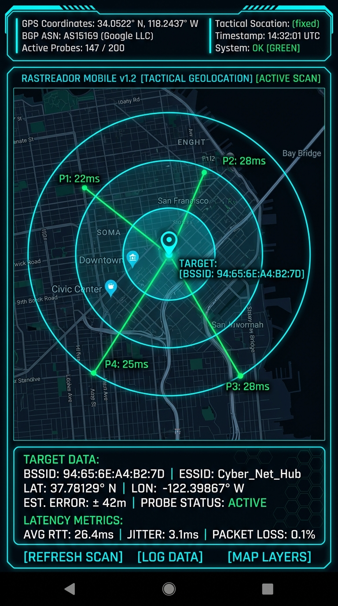
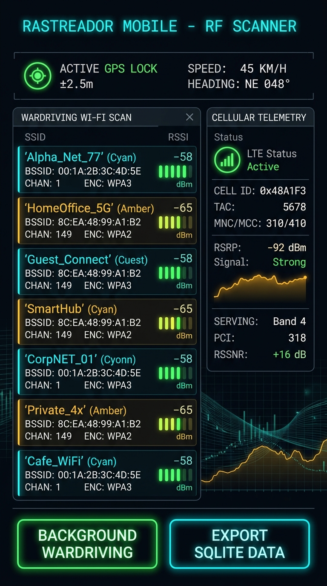
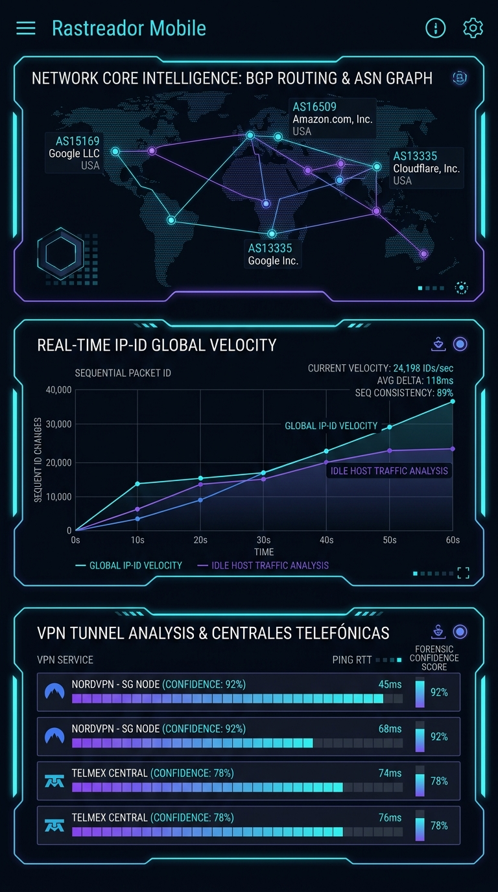

# 📱 Rastreador Mobile (Android)

**Aplicación Móvil Nativa de Geolocalización Activa, Multilateración IP, Reconocimiento BGP y Micro-Localización Wi-Fi/Celular**

> **Versión**: `1.0.0-rc1`  
> **Target SDK**: Android 15 (API 35) / Min SDK: Android 8.0 (API 26)  
> **Stack**: Kotlin 2.1 + Jetpack Compose (Material 3 Cyber-HUD) + OsmDroid + Room SQLite + Go Core Engine (Cgo/JNI)

---

## 📸 Capturas y Funcionamiento de la Aplicación

### 1. Visor de Mapas Táctico & Multilateración CBG (Constraint-Based Geolocation)

<p align="center">
  
</p>

#### ¿Cómo funciona este módulo?
* **Cálculo de Restricción CBG:** A partir del retardo RTT (*Round-Trip Time*) obtenido por las sondas de red distribuidas, la aplicación proyecta círculos concéntricos de confianza delimitando el radio geográfico máximo de la señal.
* **Micro-Triangulación de BSSID:** Se cruzan las coordenadas de balizas Wi-Fi y torres celulares observadas para converger en un punto geodésico objetivo con margen de error métrico estimado.
* **HUD Táctico Cyberpunk:** Renderizado fluido en Jetpack Compose con paleta oscura *Void Black* y *Cyber Cyan*, telemetría GPS continua, ASN BGP y estado de sondas activas en tiempo real.

---

### 2. Escáner RF, Wardriving & Telemetría Celular 4G/5G

<p align="center">
  
</p>

#### ¿Cómo funciona este módulo?
* **Captura Pasiva 802.11 (`WifiManager`):** Escucha balizas Wi-Fi en tiempo real sin requerir asociación previa, extrayendo SSID, MAC (BSSID), potencia de señal RSSI (dBm), canal y tipo de cifrado (WPA2/WPA3).
* **Torres Móviles 4G/5G (`TelephonyManager`):** Extrae parámetros de estación base celular incluyendo Cell ID, TAC (*Tracking Area Code*), MCC/MNC y niveles RSRP/RSSNR.
* **Fijación GNSS / GPS de Alta Precisión:** Bloqueo de satélites con precisión métrica (±2.5m), velocímetro integrado y cálculo de rumbo (*Heading*).
* **Modo Wardriving en Segundo Plano:** Servicio persistente (*Foreground Service*) que almacena automáticamente todas las observaciones en una base de datos local SQLite (Room) para su posterior análisis o exportación.

---

### 3. Inteligencia de Red, Grafos BGP y Velocidad IP-ID

<p align="center">
  
</p>

#### ¿Cómo funciona este módulo?
* **Grafo de Enrutamiento BGP & ASN:** Rastrea el camino de enrutamiento autónomo del objetivo (Google, Cloudflare, Amazon, etc.) identificando nodos de salida y puntos de presencia (*PoP*).
* **Monitoreo de Velocidad IP-ID en Tiempo Real:** Análisis de huella digital de hardware (**RFC 6864** / **RFC 1323**). Grafica en tiempo real los cambios secuenciales de ID de paquetes IP para detectar actividad en hosts desocupados (*Idle Host Scanning*).
* **Detección de Fugas de Túneles VPN & Centrales Telefónicas:** Identifica discrepancias de latencia entre capas L4 (TCP/UDP) y L7 (HTTP), resolviendo centrales FTTH (BAP/RIMA) y asignando una puntuación de certeza forense (*Forensic Confidence Score*).

---

## ⚡ Características Técnicas Destacadas

1. **Motor Híbrido Go + Kotlin (JNI / Cgo):**
   - Lógica de red de alto rendimiento (`pkg/recon`, `pkg/multilat`, `pkg/l2wifi`, `pkg/ipid`, `pkg/tunnel`) compilada directamente en binarios nativos `.so` / `.aar` para arquitecturas **ARM64-v8a** y **x86_64**.
   - Comunicación asíncrona no bloqueante mediante **Kotlin Coroutines** y **StateFlow** sobre `Dispatchers.IO`.

2. **Privacidad y Operación Offline:**
   - Base de datos SQLite local para almacenamiento cifrado de capturas de campo.
   - Mapas tácticos basados en OpenStreetMap / OsmDroid con soporte de caché offline y capas satelitales Esri World Imagery.

3. **Exportación de Reportes Forenses:**
   - Generación de informes forenses directos en formato **PDF** con tablas de telemetría y mapas, además de exportación en **JSON estructurado**.

---

## 🚀 Compilación e Instalación

### Requisitos
- **Android Studio Ladybug / Koala** o herramientas de línea de comandos de Android SDK (API 35).
- **JDK 17+** y **Go 1.24+** con soporte NDK.

```bash
# 1. Clonar el repositorio y posicionarse en la rama android
git checkout android

# 2. Ejecutar la suite de pruebas unitarias y de integración
./gradlew testDebugUnitTest

# 3. Compilar el APK de depuración
./gradlew assembleDebug

# 4. Instalar en tu dispositivo Android vía ADB
adb install -r release/rastreador-mobile-debug.apk
```

---

## 📁 Estructura del Proyecto

```text
rastreador-android/
├── app/
│   ├── build.gradle.kts           # Configuración Gradle, NDK, Cgo y dependencias
│   ├── proguard-rules.pro         # Protección de símbolos JNI y optimización R8
│   └── src/
│       ├── main/
│       │   ├── AndroidManifest.xml # Permisos de ubicación fina, Wi-Fi y Foreground Service
│       │   ├── java/com/dodecaneser/rastreador/
│       │   │   ├── MainActivity.kt           # Host Activity Edge-to-Edge Cyber-HUD
│       │   │   ├── RastreadorApp.kt          # Bootstrap de OsmDroid y Canales de Notificación
│       │   │   ├── core/                     # Capa de puente nativo Go / JNI / Coroutines
│       │   │   │   ├── RastreadorCoreEngine.kt
│       │   │   │   ├── JniNativeBridgeDriver.kt
│       │   │   │   └── GoBridgeImpl.kt
│       │   │   ├── sensors/
│       │   │   │   └── WardrivingService.kt  # Servicio de captura RF en background
│       │   │   └── ui/
│       │   │       ├── components/           # Modificadores Cyber-HUD y Canvas Radar
│       │   │       └── theme/                # Paleta táctica, tipografías y tema
│       │   └── res/                          # Iconos, layouts XML y configuración de red
│       └── test/                             # Suite de pruebas unitarias y de aceptación E2E
├── docs/
│   └── screenshots/               # Capturas de pantalla e ilustraciones del HUD
├── gradle/libs.versions.toml       # Catálogo de versiones centralizado
├── release/
│   └── rastreador-mobile-debug.apk # APK compilado listo para instalar (10 MB)
└── README.md
```

---

## 📄 Licencia

Este proyecto está bajo la Licencia MIT.
